# PES-VCS Project Report

- Name: `Shakthi Raja G P`
- SRN: `PES1UG25CS843`

## Overview

This project implements PES-VCS, a lightweight version control system written in C. The goal of the assignment is to understand how a version control system maps onto core operating-system and filesystem ideas such as object storage, directory trees, staging, metadata tracking, commit history, and atomic updates.

The implemented commands are:

- `pes init`
- `pes add <file>...`
- `pes status`
- `pes commit -m "<message>"`
- `pes log`

The implementation work was completed in these files:

- `object.c`
- `tree.c`
- `index.c`
- `commit.c`

## Build And Verification

The project was built and verified on Ubuntu using the provided `Makefile`.

Commands used:

```bash
make clean
make all
export PES_AUTHOR="Shakthi Raja G P <PES1UG25CS843>"
./test_objects
./test_tree
make test-integration
```

## Phase 1: Object Storage Foundation

This phase implements content-addressable object storage using SHA-256, sharded object paths, and integrity verification during reads.

### Figure 1A: Phase 1 Object Storage Tests

This figure shows that object writing, object reading, deduplication, and corruption detection work correctly.

Command used:

```bash
make clean
make test_objects
./test_objects
```

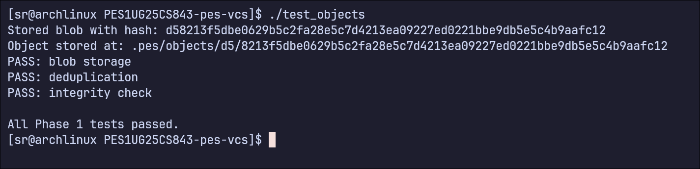

### Figure 1B: Sharded Object Store Layout

This figure shows the sharded layout of stored objects under `.pes/objects/XX/...`.

Command used:

```bash
rm -rf .pes
mkdir -p .pes/objects .pes/refs/heads
./test_objects
find .pes/objects -type f | sort
```

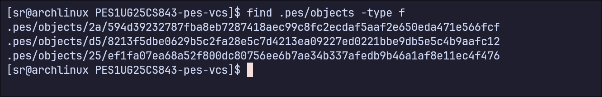

## Phase 2: Tree Objects

This phase implements deterministic tree serialization and recursive construction of directory snapshots from staged paths.

### Figure 2A: Tree Serialization And Parsing Tests

This figure shows that tree serialization and parsing are correct and deterministic.

Command used:

```bash
make clean
make test_tree
./test_tree
```

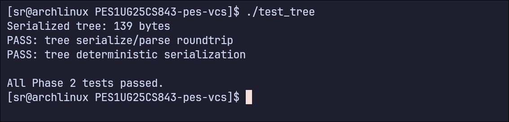

### Figure 2B: Raw Tree Object Hex Dump

These figures show the binary representation of a stored tree object and the object paths generated during the demo repository workflow.

Commands used:

```bash
make clean
make pes
export PES_AUTHOR="Shakthi Raja G P <PES1UG25CS843>"
rm -rf demo-tree
mkdir demo-tree
cd demo-tree
../pes init
mkdir -p src
printf 'hello\n' > README.md
printf 'int main(void) { return 0; }\n' > src/main.c
../pes add README.md src/main.c
../pes commit -m "Create tree snapshot"
find .pes/objects -type f | sort
xxd .pes/objects/94/391d5157dcd85f5b155682c92267ebb573db485f26fe83dcc1308096562897 | head -20
```

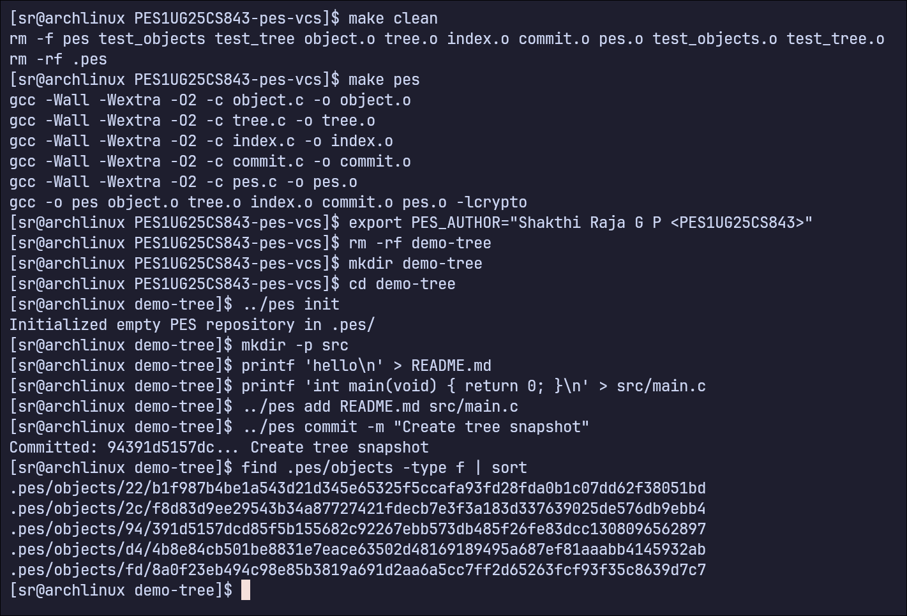

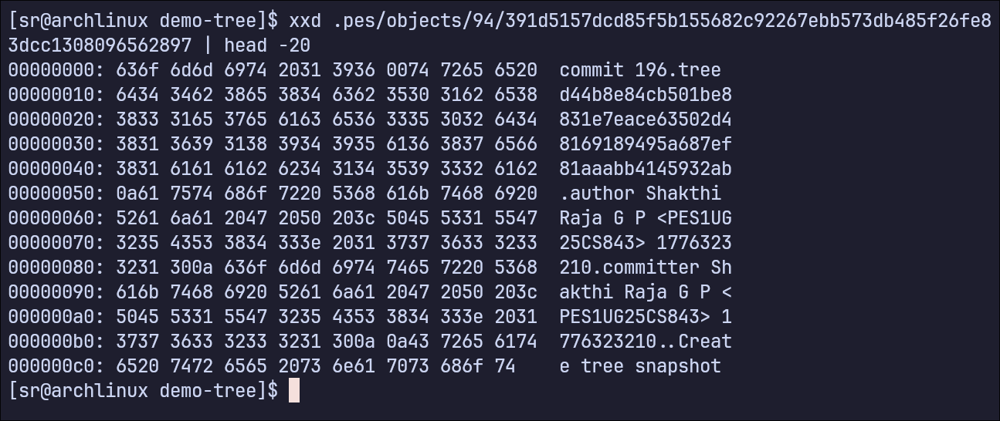

## Phase 3: The Index And Staging Area

This phase implements the text-based index file, atomic index saving, and staging files into the object store.

### Figure 3A: Add And Status Workflow

These figures show repository initialization, file staging, and the `pes status` output.

Commands used:

```bash
make clean
make pes
rm -rf .pes
./pes init
printf 'hello\n' > file1.txt
printf 'world\n' > file2.txt
./pes add file1.txt file2.txt
./pes status
```

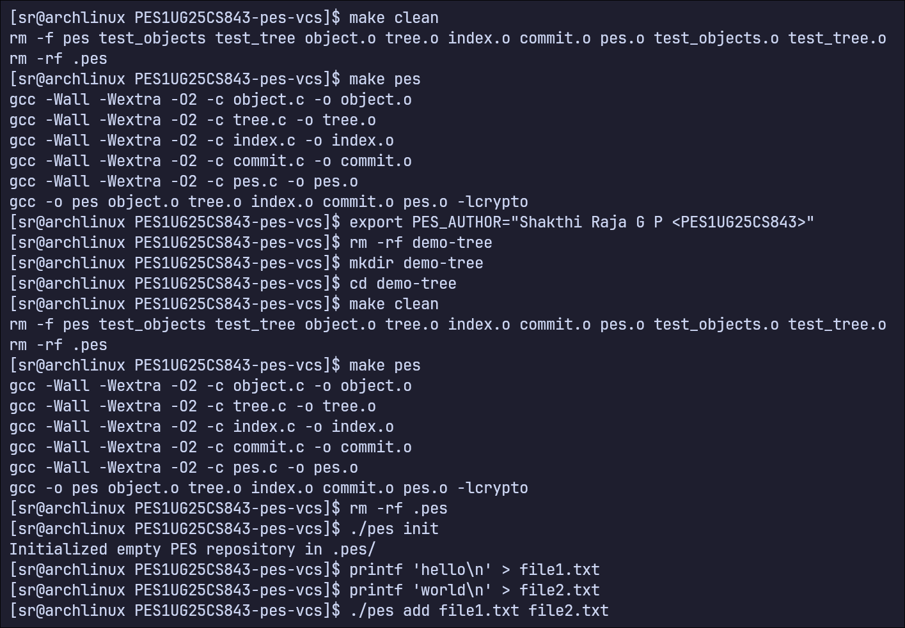

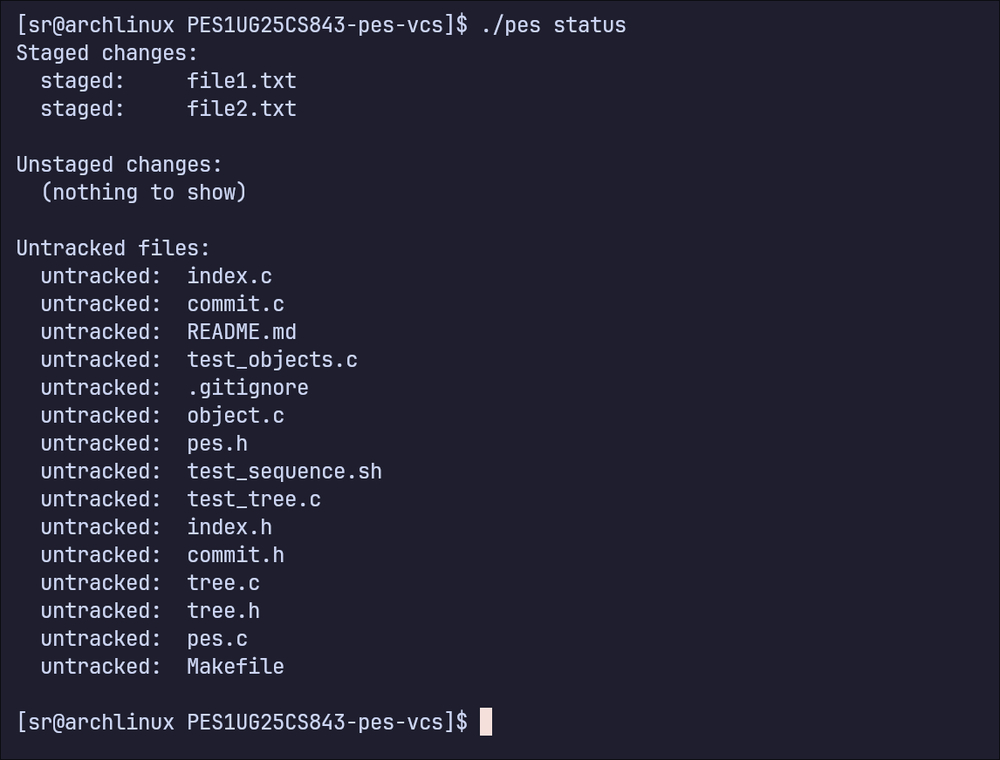

### Figure 3B: Index File Contents

This figure shows the text format of `.pes/index`, including mode, hash, modification time, size, and path.

Command used:

```bash
cat .pes/index
```

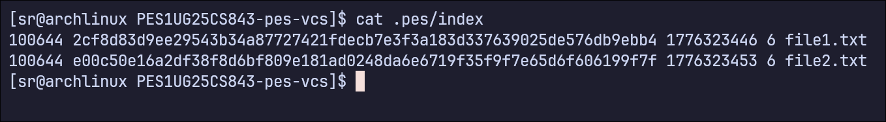

## Phase 4: Commits And History

This phase implements commit creation, parent linking, reference updates, and log traversal.

### Figure 4A: Commit Log After Three Commits

These figures show the creation of three commits and the final commit history produced by `pes log`.

Commands used:

```bash
make clean
make pes
export PES_AUTHOR="Shakthi Raja G P <PES1UG25CS843>"
rm -rf .pes
./pes init
printf 'Hello\n' > hello.txt
./pes add hello.txt
./pes commit -m "Initial commit"
printf 'World\n' >> hello.txt
./pes add hello.txt
./pes commit -m "Add world"
printf 'Goodbye\n' > bye.txt
./pes add bye.txt
./pes commit -m "Add farewell"
./pes log
```

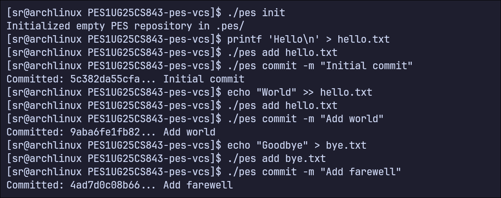

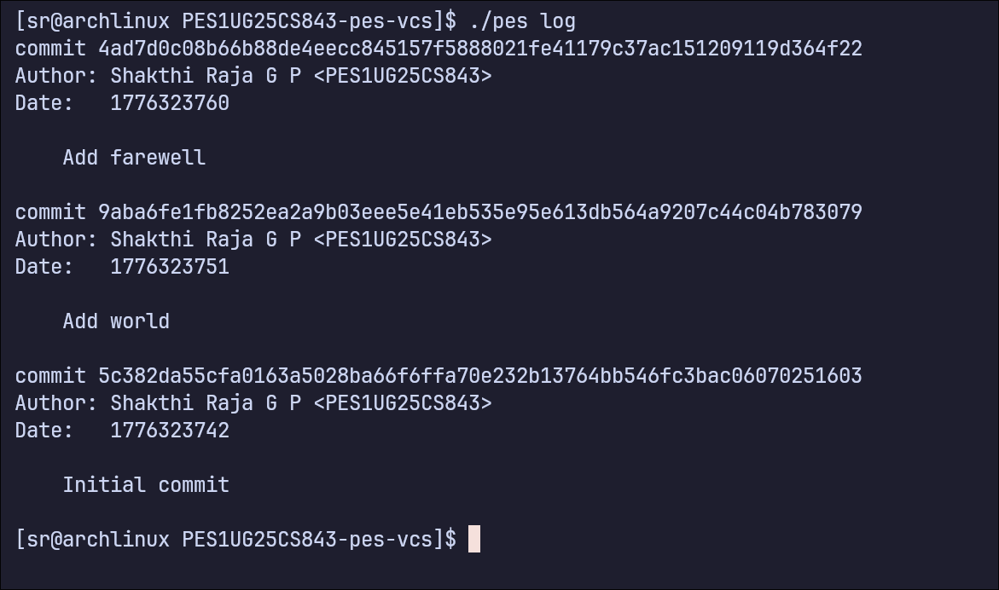

### Figure 4B: Files Inside The `.pes` Repository

This figure shows the repository metadata and object-store growth after multiple commits.

Command used:

```bash
find .pes -type f | sort
```

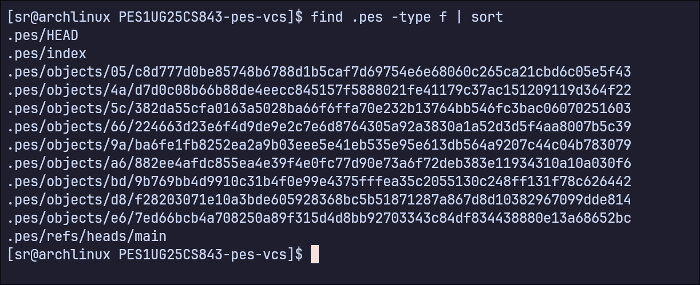

### Figure 4C: Reference Chain

This figure shows that `HEAD` points to `refs/heads/main`, and the branch file points to the latest commit hash.

Command used:

```bash
cat .pes/refs/heads/main
cat .pes/HEAD
```

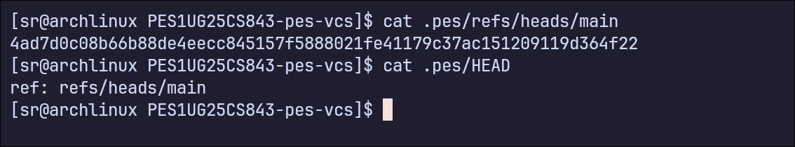

## Final Integration Test

These figures show the complete end-to-end integration workflow using the provided script.

Commands used:

```bash
make test-integration
```

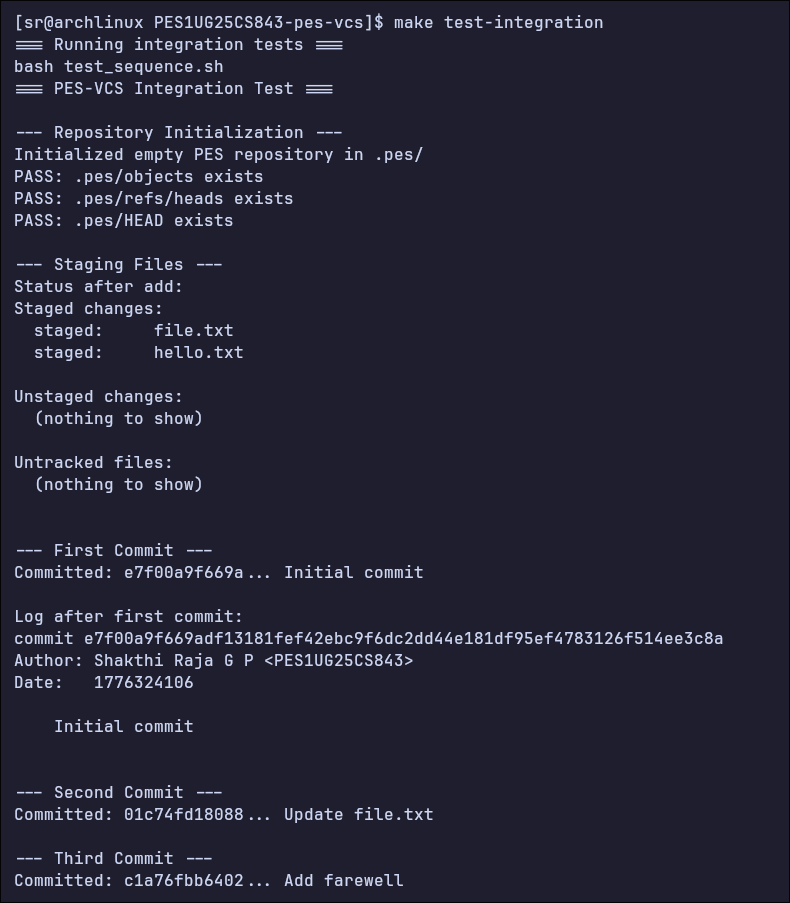

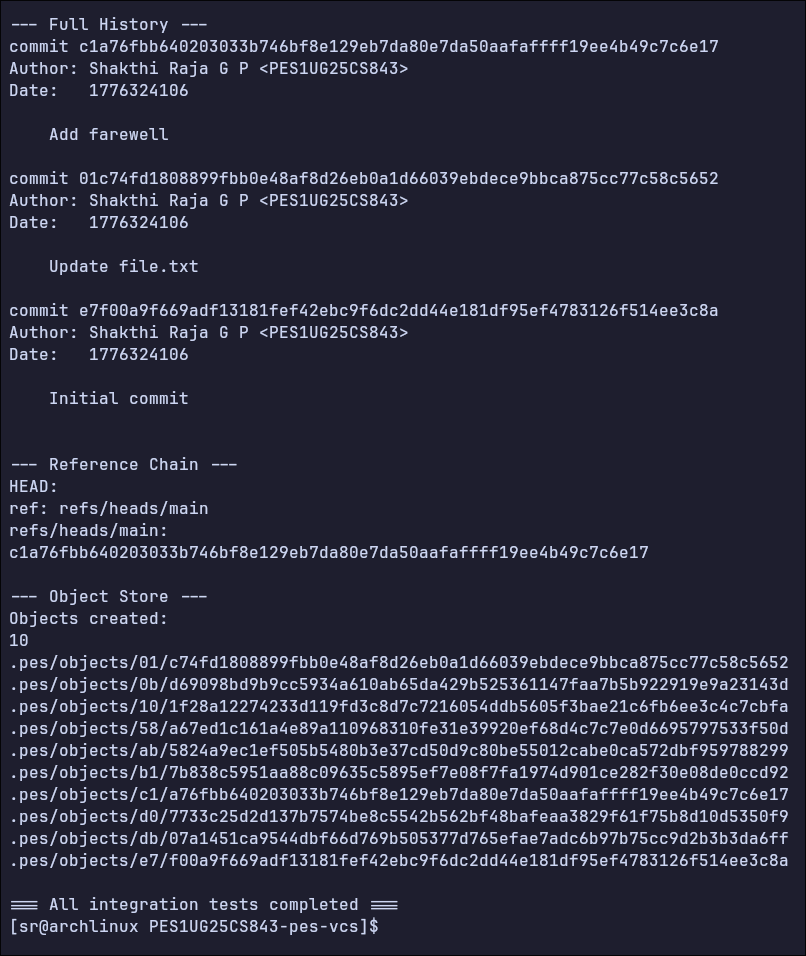

## Analysis Answers

## Phase 5: Branching And Checkout

### Q5.1

**Question:** A branch in Git is just a file in `.git/refs/heads/` containing a commit hash. Creating a branch is creating a file. Given this, how would you implement `pes checkout <branch>` — what files need to change in `.pes/`, and what must happen to the working directory? What makes this operation complex?

**Answer:** A branch in PES-VCS can be treated like Git: it is a file in `.pes/refs/heads/` that stores a commit hash. To implement `pes checkout <branch>`, the system must first read the commit hash stored in the target branch reference and then update `.pes/HEAD` so that it points to that branch. After this, the working directory must be updated to match the tree referenced by the selected commit.

The difficult part is that checkout is not just a metadata change. The system must recreate the entire staged snapshot in the working directory by reading tree objects recursively, writing file contents from blobs, creating and removing directories, and restoring file modes such as executable permissions. This also means the index should be updated to reflect the checked-out tree. The operation is complex because it must avoid overwriting local changes and keep the working directory, index, and references consistent.

### Q5.2

**Question:** When switching branches, the working directory must be updated to match the target branch's tree. If the user has uncommitted changes to a tracked file, and that file differs between branches, checkout must refuse. Describe how you would detect this "dirty working directory" conflict using only the index and the object store.

**Answer:** The dirty-working-directory conflict can be detected by comparing the working directory with the index, and then comparing the target branch with that same path. For each tracked file, the current working copy can first be checked against the index using stored metadata such as modification time and size. If needed, the file content can be re-hashed and compared with the blob hash stored in the index for a stricter check.

Once a file is found to differ from the index, the system must inspect the tree of the target branch and determine whether checkout would replace or modify that same path. If both conditions are true, the checkout must be refused because switching branches would overwrite uncommitted user changes. This can be done using only the index and the object store by loading the relevant trees and blob hashes.

### Q5.3

**Question:** "Detached HEAD" means HEAD contains a commit hash directly instead of a branch reference. What happens if you make commits in this state? How could a user recover those commits?

**Answer:** Detached HEAD means that `.pes/HEAD` stores a commit hash directly instead of storing a symbolic reference such as `ref: refs/heads/main`. If commits are created in this state, new commit objects are written normally, but no branch name moves forward to point to them. The commits exist in the object store and remain reachable only through the current detached HEAD position.

If the user later switches away from detached HEAD, those commits can become unreachable unless their hashes are known. Recovery is still possible by creating a new branch reference file that points to one of those commit hashes. In a more complete system, a reflog-like mechanism would make recovery much easier.

## Phase 6: Garbage Collection And Space Reclamation

### Q6.1

**Question:** Over time, the object store accumulates unreachable objects — blobs, trees, or commits that no branch points to (directly or transitively). Describe an algorithm to find and delete these objects. What data structure would you use to track "reachable" hashes efficiently? For a repository with 100,000 commits and 50 branches, estimate how many objects you'd need to visit.

**Answer:** Garbage collection can be implemented using a mark-and-sweep strategy. First, start from every live reference, including all files in `.pes/refs/heads/` and a direct commit hash in `.pes/HEAD` if detached HEAD is in use. Then walk through all reachable commits by following parent pointers. For each reachable commit, also mark its root tree, all subtrees, and all blobs reachable from those trees.

A hash set is the most suitable data structure for tracking reachability because insertion and lookup are efficient. After the mark phase, the object store can be scanned and any object whose hash is not in the reachable set can be deleted. In a repository with 100,000 commits and 50 branches, the exact number of visited objects depends on sharing between trees and blobs, but the algorithm still needs to visit every reachable commit and every reachable tree and blob at least once.

### Q6.2

**Question:** Why is it dangerous to run garbage collection concurrently with a commit operation? Describe a race condition where GC could delete an object that a concurrent commit is about to reference. How does Git's real GC avoid this?

**Answer:** Garbage collection is dangerous during commit creation because a commit is built in stages. A blob or tree object may already be written into `.pes/objects/`, but the final commit object and updated branch reference may not yet exist. If garbage collection runs at that time, it may see the newly written object as unreachable and delete it.

This creates a race condition where the commit process finishes later and records references to objects that have already been removed, leaving the repository corrupted. Real Git avoids this through careful coordination, temporary object protection, reflogs, conservative pruning rules, and by ensuring that recently created objects are not collected too early.
